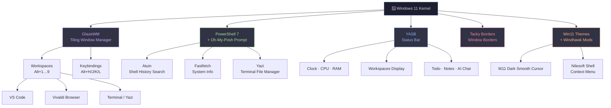
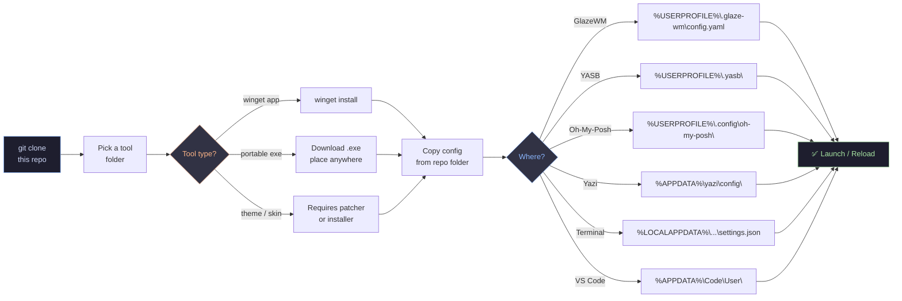
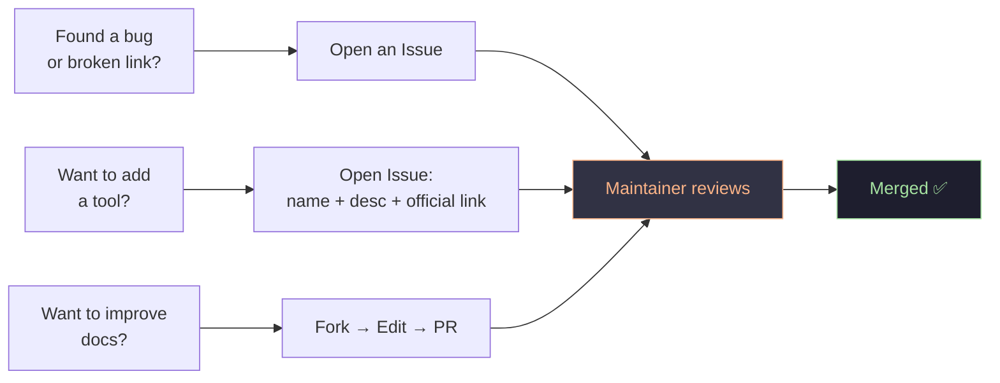

<div align="center">
# Windows 11 Power User Collection

> A curated, battle-tested collection of 200+ tools for Windows 11 — covering system optimization, developer workflows, visual customization, privacy, and beyond. Mostly Keyboard driven workflow with cappuccin vibes.

[](https://opensource.org/licenses/MIT)
[](https://www.microsoft.com/windows)
[](./Useful_Programms.md)

</div>

---

## Quick Links

- [Complete Tool Catalog](./Useful_Programms.md) — All 200+ tools with descriptions and direct download links
- [Quick Start](#-quick-start) — Install essentials in minutes
- [Gallery](#gallery) — Visual showcase

---

## Gallery


---
## 📐 System Architecture
 
How all the layers fit together — from the OS kernel up to what you actually see and touch:
 

 
---
 
## 🗂️ Repository Structure
 
```
Win-11-Config/
├── Assets/               ← Screenshots & gallery images
├── Atuin/                ← Shell history config
├── Claude/               ← AI assistant config
├── Discord - vencord/    ← Vencord theme & plugins
├── Fastfetch/            ← System info display
├── File Pilot/           ← Lightweight file manager
├── Flow Launcher/        ← App launcher (Alt+Space)
├── Glazewm/              ← Tiling WM config.yaml
├── Nilesoft Shell/       ← Right-click menu
├── Notepad++/            ← Editor theme & settings
├── Oh-My-Posh/           ← Shell prompt theme
├── Qbtorrent/            ← Torrent client config
├── Tacky-Borders/        ← Window border colors
├── Terminal/             ← Windows Terminal settings
├── Unigetui/             ← Package manager GUI
├── Vivaldi/              ← Browser config
├── Vscode/               ← Editor settings + keybinds
├── W11 Cursor Dark Smooth/
├── Wallpaper/            ← Curated wallpapers
├── Win 11 Themes/        ← Custom .msstyles
├── Windhawk/             ← UI mod configs
├── Yasb/                 ← Status bar config + CSS
├── Yazi/                 ← Terminal file manager
├── Useful_Programms.md   ← Full 200+ tool catalog
└── README.md
```
 
---


## ⚡ Quick Start
 
### Prerequisites
 
- Windows 11 (most tools work on Windows 10 too)
- Administrator access
- PowerShell 7+ recommended
### Method 1 — Winget (Fastest)
 
```powershell
winget install glzr-io.glazewm
winget install AmN.yasb
winget install JanDeDobbeleer.OhMyPosh
winget install Flow-Launcher.Flow-Launcher
winget install sxyazi.yazi
winget install Microsoft.WindowsTerminal
winget install Microsoft.VisualStudioCode
winget install VivaldiTechnologies.Vivaldi
winget install MartiCliment.UniGetUI
winget install RaMMicHaeL.Windhawk
winget install Notepad++.Notepad++
winget install qBittorrent.qBittorrent
winget install atuinsh.atuin
winget install fastfetch-cli.fastfetch
```
 
### Method 2 — UniGetUI (GUI, no typing)
 
1. Install [UniGetUI](https://github.com/marticliment/UniGetUI/releases/latest)
2. Search any tool across winget / Scoop / Chocolatey / pip / npm / cargo
3. Click Install — done
### Method 3 — Chris Titus WinUtil
 
```powershell
# Run in elevated PowerShell
irm christitus.com/win | iex
```
 
---
 
## 🔧 Config Deployment Flow
 
How to apply configs after cloning this repo:
 

 
---
 
## 🌟 Core Tools — Deep Dive
 
### GlazeWM — Tiling Window Manager
 
Inspired by i3 on Linux. Windows auto-tile. No mouse needed.
 
```powershell
winget install glzr-io.glazewm
# Config → %USERPROFILE%\.glaze-wm\config.yaml
```
 
| Action | Keybind |
|---|---|
| Focus left/right/up/down | `Alt + H/L/K/J` |
| Move window | `Alt + Shift + H/L/K/J` |
| Switch workspace | `Alt + 1–9` |
| Close window | `Alt + Q` |
| Toggle floating | `Alt + T` |
| Launch terminal | `Alt + Enter` |
 
---
 
### YASB — Status Bar
 
```powershell
winget install AmN.yasb
# Config → %USERPROFILE%\.yasb\config.yaml + styles.css
```
 
Widgets included in this config:
- Workspaces (synced with GlazeWM)
- Clock · CPU · RAM · GPU
- Todo list · Notes · Local AI chat
- Media player controls
Reload live: **Tray icon → Reload**
 
---
 
### Oh-My-Posh — Shell Prompt
 
```powershell
winget install JanDeDobbeleer.OhMyPosh
# Add to $PROFILE:
oh-my-posh init pwsh --config "$env:USERPROFILE\.config\oh-my-posh\theme.omp.json" | Invoke-Expression
```
 
> ⚠️ Requires a [Nerd Font](https://www.nerdfonts.com/font-downloads) in your terminal for icons.
 
---
 
### Flow Launcher — App Launcher
 
```powershell
winget install Flow-Launcher.Flow-Launcher
# Config → %APPDATA%\FlowLauncher\Settings\
```
 
Hotkey: `Alt + Space`
Recommended plugins: `Everything`, `Calculator`, `Shell`, `Browser Bookmarks`
 
---
 
### Yazi — Terminal File Manager
 
Written in Rust. Fastest file manager available on Windows.
 
```powershell
winget install sxyazi.yazi
# Config → %APPDATA%\yazi\config\
```
 
Add to PowerShell `$PROFILE` for directory-follow-on-exit:
 
```powershell
function y {
    $tmp = [System.IO.Path]::GetTempFileName()
    yazi $args --cwd-file="$tmp"
    $cwd = Get-Content -Raw $tmp
    if (-not [String]::IsNullOrEmpty($cwd) -and $cwd -ne $PWD.ProviderPath) {
        Set-Location -LiteralPath $cwd
    }
    Remove-Item -Path $tmp
}
```
 
Launch: `y` · Quit: `q`
 
---
 
### Windhawk — UI Mod Platform
 
```powershell
winget install RaMMicHaeL.Windhawk
```
 
Included mods in this config:
 
| Mod | Effect |
|---|---|
| Taskbar Clock Customization | Custom date/time format |
| Windows 11 Taskbar Styler | Full taskbar restyle |
| Explorer Taskbar Tweaker | Advanced taskbar behavior |
| Disable Windows Copilot | Remove Copilot button |

And many more !

---
 
### Nilesoft Shell — Context Menu
 
```
Download: nilesoft.org/download
Config → C:\Program Files\Nilesoft Shell\imports\
Edit: shell.nss (changes apply live, no restart)
```
 
---
 
### Win 11 Themes — Custom Visual Themes
 
> Requires [UltraUxThemePatcher](https://melloware.com/ultrauxthemepatcher/) — install first, then restart.
 
```
Copy .msstyles → C:\Windows\Resources\Themes\
Settings → Personalization → Themes → select theme
```
 
---
 
### Tacky Borders — Hyprland-Style Window Borders
 
```
Download from: github.com/lukeyou05/tacky-borders
Config → %USERPROFILE%\.config\tacky-borders\config.yaml
```
 
Edit `config.yaml` to set active/inactive colors and border width.
 
---
 
### Atuin — Shell History
 
```powershell
winget install atuinsh.atuin
# Add to $PROFILE:
Invoke-Expression (& atuin init powershell | Out-String)
```
 
Replaces `Ctrl+R`. Searchable, syncable, timestamped history.
 
---
 
### Vivaldi — Power-User Browser
 
```powershell
winget install VivaldiTechnologies.Vivaldi
# Sync via built-in Vivaldi Sync
# Manual config → %LOCALAPPDATA%\Vivaldi\User Data\Default\
```
 
Enable: Tab Stacking · Speed Dials · Custom Keyboard Shortcuts
 
---
 
### VS Code
 
```powershell
winget install Microsoft.VisualStudioCode
# settings.json  → %APPDATA%\Code\User\settings.json
# keybindings    → %APPDATA%\Code\User\keybindings.json
 
# Install all extensions:
cat extensions.txt | xargs -I{} code --install-extension {}
```
 
---

 
## 🔒 Security Best Practices
 
- Download **only** from official links in [Useful_Programms.md](./Useful_Programms.md)
- Verify code signatures where available
- Prefer **portable** versions to avoid unnecessary registry modifications
- Use **HiBit Startup Manager** to audit what runs at boot after installs
- Back up existing configs before copying from this repo
---
 
## 🤝 Contributing
 

 
1. **Report** — broken links, outdated tools, missing entries
2. **Suggest** — open an issue with name, description, and official link only
3. **Improve** — fix typos, add usage notes, update configs
> Link only to official sources. Follow the existing format.
 
---
 
## 📜 License
 
Distributed under the **MIT License**.
Individual tools retain their own licenses — see each project's documentation.
 
---
 
<div align="center">
**Made with ☕ cappuccino vibes on Windows 11**
 
[⬆ Back to top](#-win-11-config)
 
</div>

